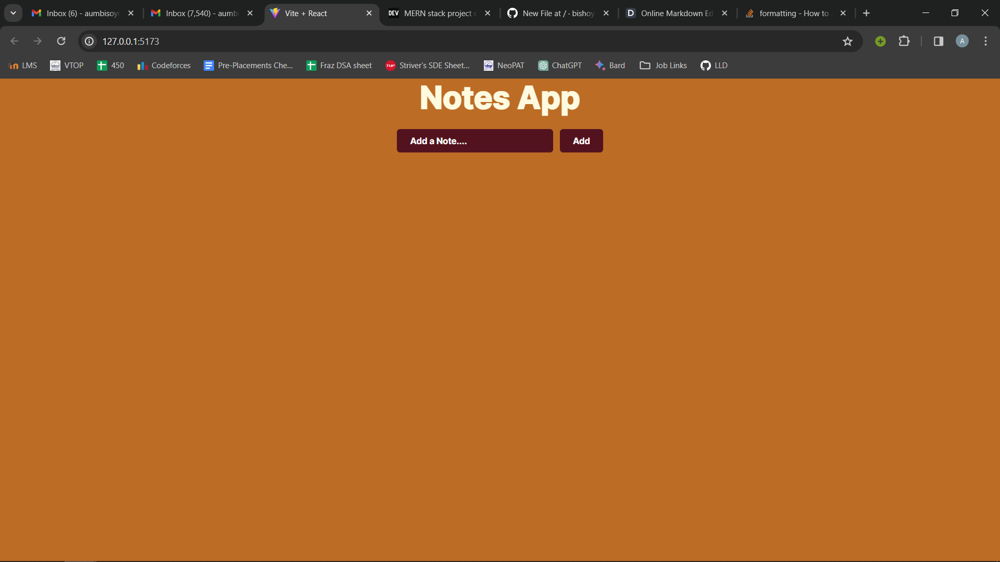
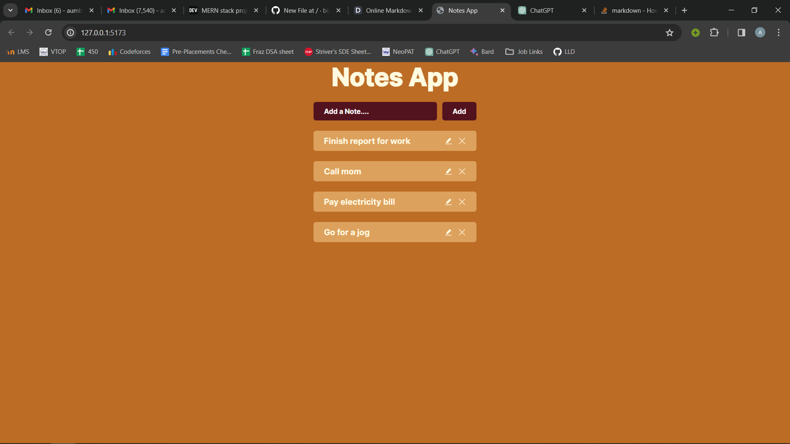

# Notes App
### It is a simple and intuitive notes application designed to help you capture and organize your thoughts, ideas, tasks, and more.

&nbsp; 

## Tech Stack used
- ### NodeJS
- ### ExpressJS
- ### MongoDB
- ### ReactJS

&nbsp; 

## Features
- ### Create a new to-do note
- ### Update an existing to-do note
- ### Get the existing to-do notes list
- ### Delete an existing to-do note
- ### Create mulitple to-do notes
- ### Upload an image
- ### Uses Joi Pacakge for input verification

&nbsp; 

## Run on your machine
- ##### Download project zip file and extract.
- ##### Open root directory of the project in your terminal.
- ##### Open powershell window and run mongodb server
 ```sh
mongod
```
- ##### Move to backend folder and install packages for backend then run the server.
```sh
cd backend
npm i
nodemon server
```
- ##### Open another terminal from your root project directory then move to frontend directory from your terminal then install node packages and start the server.
```sh
cd frontend
npm i
npm run dev
```
- ##### Then voila just open the link from your client terminal and the project will open on your browser.

&nbsp; 

## Screenshots
- ### Initially when you open the link.

- ### After adding some notes.

- ### To update a note.

- ### Screenshots of the database

